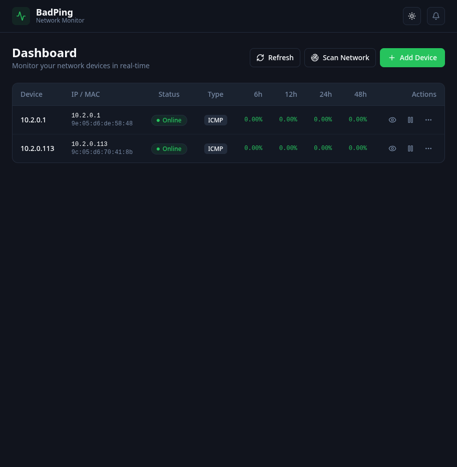
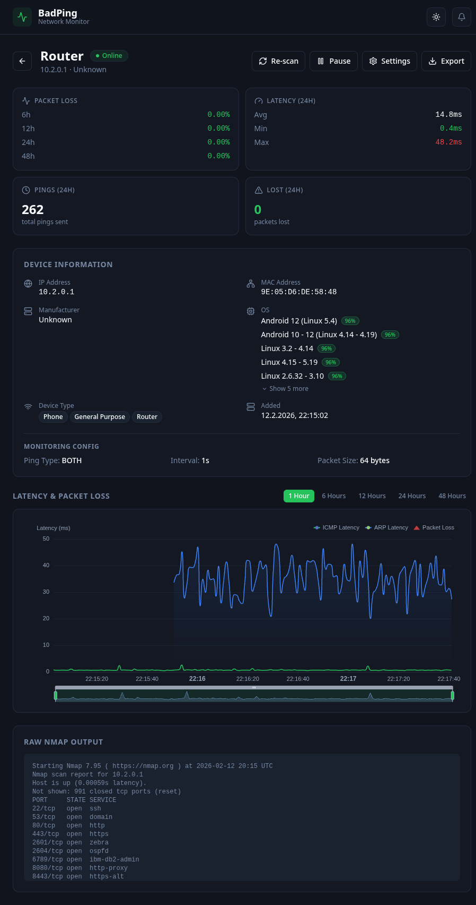
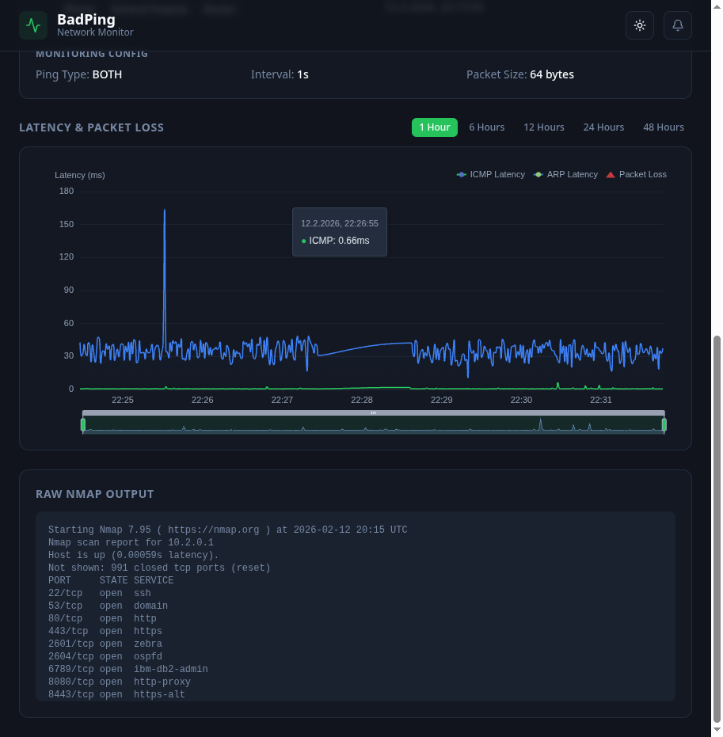
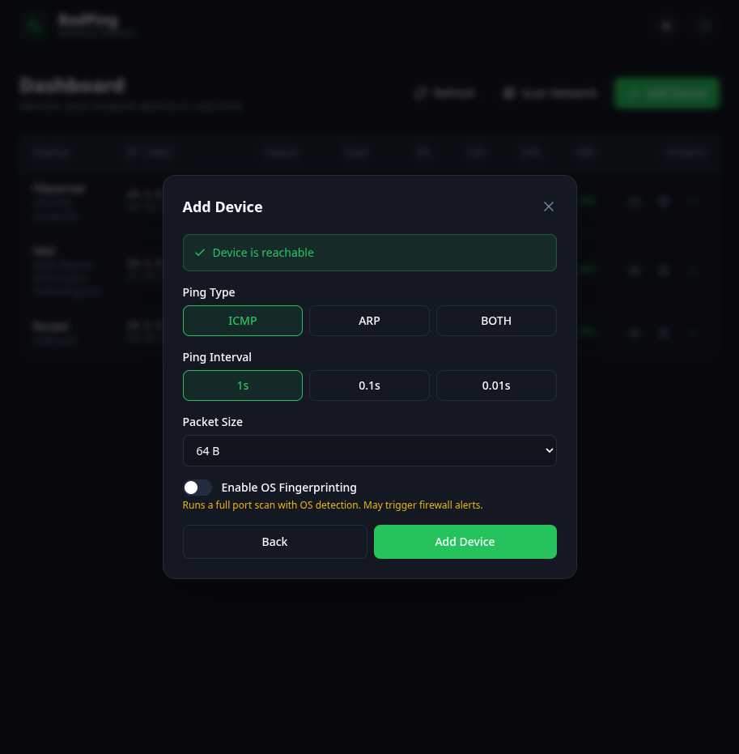
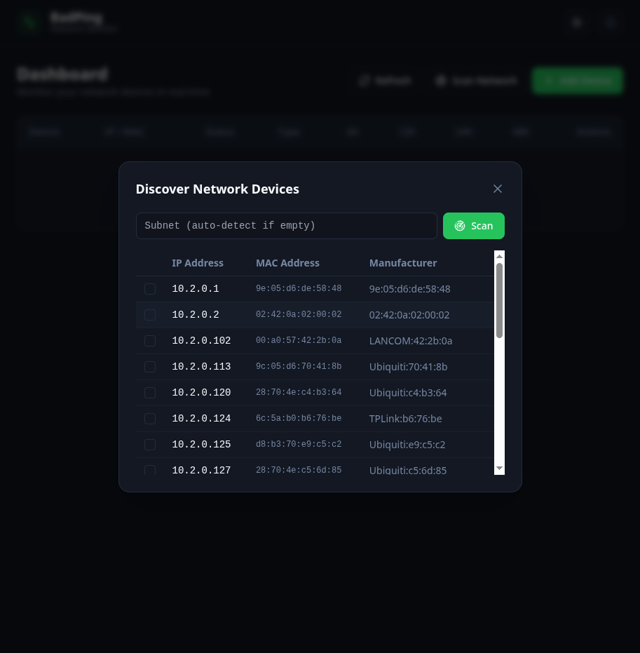
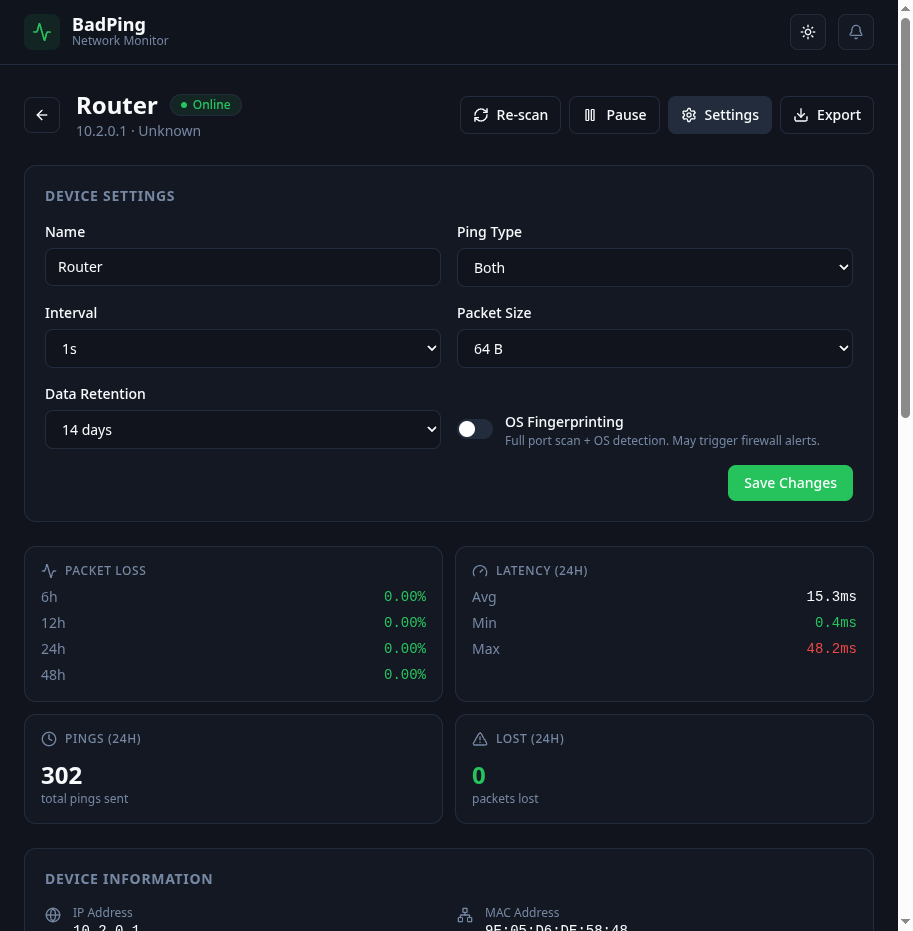

# BadPing

I built BadPing because I kept having random network drops at home and had no idea where the problem was — the router, a switch, an access point? I needed something that would just sit there and ping everything on my network so I could go back later and see exactly when and where things went wrong.

It runs ICMP and ARP pings against any device you throw at it, logs everything to a local database, and gives you charts to figure out what's actually happening. Nothing fancy, just the data you need to track down flaky network gear.



## What it does

- Pings devices via ICMP, ARP, or both at the same time
- Adjustable intervals down to 10ms if you need really granular data
- Tracks packet loss over 6h / 12h / 24h / 48h windows
- Interactive latency charts you can zoom and pan through
- Separate ICMP and ARP lines when running both protocols
- Auto-discovers devices on your subnet via ARP scan
- Identifies devices with nmap (OS, manufacturer, open ports)
- Sends notifications when a device goes down or comes back up
- Export your data as CSV whenever you need it
- Dark and light themes
- Ships as a single Docker container

## Screenshots

<details>
<summary>Device detail page</summary>



Shows packet loss stats, latency numbers, device info from nmap (OS guesses with confidence scores, device type, MAC, manufacturer), the latency chart, and raw nmap output at the bottom.
</details>

<details>
<summary>Latency chart with dual ICMP/ARP</summary>



When a device is set to ping with both ICMP and ARP, the chart shows them as separate lines. You can toggle each one on/off in the legend. Supports zooming into specific time ranges with the slider at the bottom.
</details>

<details>
<summary>Adding a device</summary>



Pick your ping type (ICMP, ARP, or both), set the interval, choose packet size, and optionally enable OS fingerprinting. The dialog checks reachability before you commit.
</details>

<details>
<summary>Network discovery</summary>



ARP-scans your local subnet and lists everything it finds with IP, MAC, and manufacturer. Select the ones you want to monitor and add them in bulk.
</details>

<details>
<summary>Device settings</summary>



Change ping type, interval, packet size, and data retention per device. OS fingerprinting is opt-in since it runs a full port scan that might set off firewall alerts.
</details>

## Getting started

### Docker

```bash
docker compose up -d
```

Then open http://localhost:8765 in your browser.

The `docker-compose.yml` is already set up with the right capabilities. If you're running the container manually:

```bash
docker build -t badping .
docker run -d \
  --name badping \
  --network host \
  --cap-add NET_RAW \
  --cap-add NET_ADMIN \
  -v badping-data:/data \
  -p 8765:8765 \
  badping
```

`NET_RAW` and `NET_ADMIN` are needed for ICMP and ARP to work. `--network host` is required for ARP pings to reach devices on your local subnet. Without these, you'll still get ICMP pings but ARP features will be disabled (the UI shows a warning banner).

### Development

Backend:
```bash
cd backend
python -m venv venv && source venv/bin/activate
pip install -r requirements.txt
BADPING_DB_PATH=./data/badping.db uvicorn app.main:app --reload --port 8000
```

Frontend (separate terminal):
```bash
cd frontend
npm install
npm run dev
```

The frontend dev server runs on port 3000 and proxies API calls to the backend on port 8000.

## Configuration

All optional. Set these as environment variables or in `docker-compose.yml`:

| Variable | Default | What it does |
|---|---|---|
| `BADPING_DB_PATH` | `/data/badping.db` | Where the SQLite database lives |
| `BADPING_DEFAULT_INTERVAL` | `1.0` | Default seconds between pings |
| `BADPING_DEFAULT_RETENTION_DAYS` | `14` | How many days of data to keep |
| `BADPING_DEGRADED_LOSS_PCT` | `5.0` | Packet loss % before marking a device as degraded |
| `BADPING_OFFLINE_LOSS_SECONDS` | `30` | Seconds of 100% loss before marking a device offline |

## Unraid

Works great on Unraid. Set it up as a Docker container:

1. **Network Type**: Host
2. **WebUI**: `http://[IP]:8765`
3. **Path**: Map `/data` to `/mnt/user/appdata/badping`
4. **Extra Parameters**: `--cap-add=NET_RAW --cap-add=NET_ADMIN`

<details>
<summary>Community Apps XML template</summary>

```xml
<?xml version="1.0"?>
<Container version="2">
  <Name>BadPing</Name>
  <Repository>YOUR_DOCKERHUB/badping</Repository>
  <Registry>https://hub.docker.com/r/YOUR_DOCKERHUB/badping</Registry>
  <Network>host</Network>
  <Shell>bash</Shell>
  <Privileged>false</Privileged>
  <Support>https://github.com/YOUR_USERNAME/badping/issues</Support>
  <Overview>Network monitoring tool that pings devices via ICMP and ARP to track latency and packet loss across your network.</Overview>
  <Category>Network:Management Tools:</Category>
  <WebUI>http://[IP]:8765</WebUI>
  <Icon>https://raw.githubusercontent.com/YOUR_USERNAME/badping/main/frontend/public/favicon.svg</Icon>
  <ExtraParams>--cap-add=NET_RAW --cap-add=NET_ADMIN</ExtraParams>
  <Config Name="Data Path" Target="/data" Default="/mnt/user/appdata/badping" Mode="rw" Description="Database storage" Type="Path" Display="always" Required="true">/mnt/user/appdata/badping</Config>
  <Config Name="WebUI Port" Target="8765" Default="8765" Mode="tcp" Description="Web interface port" Type="Port" Display="always" Required="true">8765</Config>
</Container>
```
</details>

## How it works

The backend is Python with FastAPI. It runs a monitoring loop per device that fires off pings at the configured interval, buffers the results, and flushes them to SQLite in batches every second. The frontend is a Nuxt 3 SPA that polls the API every 5 seconds and renders everything with ECharts for the charts and Tailwind for the UI.

ICMP pings use icmplib. ARP pings use scapy, which also handles network discovery and MAC vendor lookups. Device fingerprinting is done by shelling out to nmap. Everything runs inside a single Docker container with nginx as a reverse proxy and supervisord managing the processes.

The database is SQLite with WAL mode turned on so reads don't block writes. Ping results are indexed by device and timestamp for fast range queries. The graph endpoint auto-buckets data depending on the time range you're looking at (raw points for 1h, 1s buckets for 6h, 10s for 12h, 60s for 24h+).

## License

MIT
